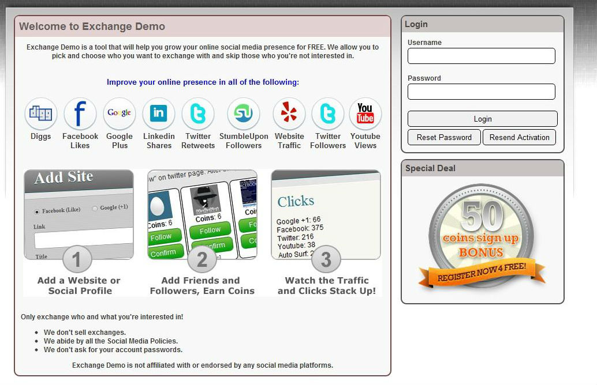

## Social Exchange Script

Built off of the idea of EazySubs, a better scipt was built in 2011, at the age of 15, under Tectrify, to provide users with a chance to open their own exchange website. Using plugins, users would be able to buy the social media packages they wanted.

A couple hundred scripts were sold at around $100 each, based on the number of plugins the user selected.

## Marketed Description

SocialExchangeScript is an exchange system that is very user friendly for both the user and the owner. As an owner, all you have to do is drag and drop plugins into a folder and adminster through an amazing administration panel. 

Social Exchange Script is a tool that will help you grow your online social media presence for FREE. It allow you to pick and choose who you want to exchange with and skip those who you're not interested in. 

Some Features: 
Exchange systems for: 
Google +1 
Twitter Followers 
Digg Followers 
Facebook Likes 
Youtube Views 
Traffic Exchange 

Auto-Surf bar for traffic exchange (with anti-framebreaker) 
Paypal integrated 
Buy Points page 
Add unlimited points packs 
Manage packs from Control Panel 
Control how much points you want to spend for every website 
Cost per click for every website submited 
Coupon Codes 
Referrals system 
Stats page 

Powerful control panel: 
advanced stats for users, clicks, websites, sales 
users management 
site management 
website settings management 
maintenance mode 